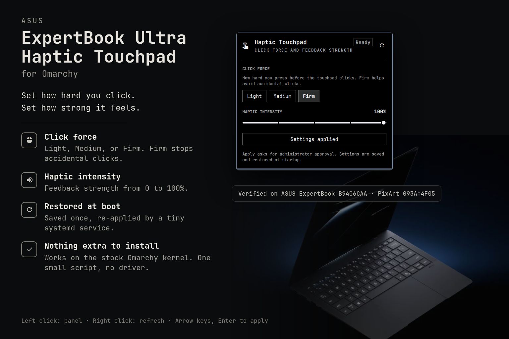

# ASUS ExpertBook Ultra Haptic Touchpad



An [Omarchy](https://omarchy.org) bar widget for the haptic touchpad in the ASUS ExpertBook Ultra B9406CAA, a PixArt `093A:4F05` controller. It is not for Dell XPS haptic touchpads; Omarchy handles those itself. It sets how hard you press before the touchpad clicks and how strong the click feedback feels. Settings apply immediately and are restored when the shell starts.

Verified on the ASUS ExpertBook B9406CAA. Other laptops must have the same touchpad controller; see [COMPATIBILITY.md](COMPATIBILITY.md) for the hardware check and a four-step test.

## Settings

| Setting | Values | Effect |
|---|---|---|
| Click force | Light, Medium, Firm | Pressure needed to trigger a click, roughly 110 to 190 g. Firm helps avoid accidental clicks. |
| Haptic intensity | 0–100% | Strength of the vibration produced by a click. |

## How it works

The repository has two parts:

- **The bar widget** (`Panel.qml` and friends) runs inside the Omarchy shell as your user. It shows the panel and, when the shell starts, re-sends the saved settings.
- **The controller** (`controller/asus-b9406-hapticctl`) is a small Python script with no dependencies beyond the standard library. It sends HID feature reports to the touchpad through the kernel's hidraw interface and keeps the saved values in `~/.config/asus-b9406-haptic-touchpad.conf`.

Both run as your user. The only privileged step is a one-time udev rule that lets your session open the touchpad's device node; see below. No kernel module or driver is needed. The touchpad already works with the in-tree `hid-multitouch` driver.

## Why Omarchy does not already do this

Checked on 2026-09-18 against Omarchy 4.0.4 with kernel 7.2.5-3-omarchy.

**Omarchy's haptic support is Dell-only.** The Trigger > Hardware > Touchpad Haptics menu calls `dell-xps-touchpad-haptics`, a package Omarchy installs only when `omarchy-hw-dell-xps-haptic-touchpad` matches a Dell XPS. Nothing in Omarchy speaks to the PixArt controller. The only ASUS B9406 touchpad handling in Omarchy is a libinput quirk that fixes cursor movement; it never writes to the device.

**The kernel exposes the haptics of this touchpad, but not these two settings.** Linux 6.18 added HID haptic touchpad support, and the Omarchy kernel builds it in. That support covers host-initiated feedback: user space can play press and release waveforms through the force-feedback interface. The kernel driver also refuses to treat this touchpad as a haptic touchpad at all. The device declares no haptic waveforms or triggers for the host to play, and it reports press force without a physical unit, both of which the driver requires. The touchpad input device therefore advertises no force-feedback capability.

The two settings this plugin changes are standard HID feature reports that the kernel simply has no interface for:

| Report | HID usage | Meaning |
|---|---|---|
| 8 | Digitizer page, `0xB0` Button Press Threshold | Click force |
| 9 | Haptics page, `0x23` Intensity | Haptic intensity |

These are "device-initiated" knobs: the touchpad decides when to click and how hard to vibrate, and the host only adjusts the thresholds. A June 2026 proposal on the linux-input list to expose exactly these two usages was still an open RFC at the time of writing, with the maintainer preferring the host-initiated model. Until something like it lands, the only way to set them on Linux is to write the feature reports directly, which is what the controller here does through hidraw. Windows exposes the same two knobs as the "Touchpad feedback" and click-pressure settings.

## Why this needs a udev rule

The touchpad's hidraw device node is owned by root with no group or world access. Sending it a feature report means opening that node for writing, and by default only root can. Version 1 of this plugin crossed that line with a root-installed controller, a Polkit prompt on every Apply, and a systemd unit at boot. Version 2 removes the line instead.

One udev rule tags the node with `uaccess`:

```
SUBSYSTEM=="hidraw", KERNELS=="0018:093A:4F05.*", TAG+="uaccess"
```

`uaccess` is the standard systemd mechanism that gives the user at the active seat access to devices such as webcams and security keys. systemd-logind adds an ACL for your user to that one node, and removes it when you log out. Nothing else changes. The rule matches only the PixArt `093A:4F05` HID device, so no other hidraw node is exposed.

With the rule in place, the widget, the controller, and the saved settings file are all yours and all unprivileged. Nothing in the plugin directory is ever read, copied, or executed as root. The only thing root ever does is write that one static line, once, with `tee`, from text you paste yourself.

## Requirements

- A PixArt `093A:4F05` touchpad. Run the check in [COMPATIBILITY.md](COMPATIBILITY.md) if unsure.
- Omarchy with plugin support.
- Python 3, which Omarchy already ships.

## Installation

### Step 0: if you came here on a fresh Omarchy install

If you just installed Omarchy on a B9406CAA and the touchpad clicks but the cursor does not move, stop here first. That is not a haptics problem and this plugin cannot fix it.

Omarchy ships the right fix but puts it in the wrong place. Its install script writes a libinput quirk to `/etc/libinput/asus-expertbook-b9406.quirks`, and libinput reads only `/etc/libinput/local-overrides.quirks` from that directory, so the fix is never loaded. Checked on Omarchy 4.0.4 with libinput 1.31.3 using `libinput quirks list --verbose`. The Omarchy tag `v4.0.4` and the current default branch both still write the ignored filename. Upstream knows: [PR #6388](https://github.com/omacom/omarchy/pull/6388) carries the fix and was still open at the time of writing.

Skip this step if the cursor already works. Otherwise write the file yourself, then log out and back in:

```bash
sudo tee /etc/libinput/local-overrides.quirks >/dev/null <<'QUIRK'
[ASUS ExpertBook B9406 Touchpad]
MatchBus=i2c
MatchUdevType=touchpad
MatchVendor=0x093A
MatchProduct=0x4F05
MatchDMIModalias=dmi:*svnASUS*:pn*B9406*
AttrEventCode=-ABS_MT_PRESSURE;-ABS_PRESSURE;
QUIRK
```

The rule only tells libinput to ignore the touchpad's broken pressure axes. This step goes away once Omarchy renames its file. The same fix is packaged as the `touchpad-fix` module of [asus-expertbook-linux](https://github.com/burakgon/asus-expertbook-linux), which is where this quirk comes from.

### Step 1: add the plugin

Add the plugin. The Omarchy installer clones the repository and never runs anything as root:

```bash
omarchy plugin add https://github.com/bramvera/omarchy-asus-expertbook-haptic-touchpad.git --enable
```

### Step 2: let your session open the touchpad

Write the udev rule and load it. This is the one step that needs root, and it runs only `tee` and `udevadm`:

```bash
sudo tee /etc/udev/rules.d/70-asus-b9406-haptic-touchpad.rules >/dev/null <<'RULE'
SUBSYSTEM=="hidraw", KERNELS=="0018:093A:4F05.*", TAG+="uaccess"
RULE
sudo udevadm control --reload-rules && sudo udevadm trigger --subsystem-match=hidraw
```

It takes effect immediately for the current session and at every boot after that. Right-click the icon in the bar if it was already showing "not set up".

### Upgrading from 1.x

Version 1 installed a root-owned controller and a boot service. Remove them with the uninstaller it left in `/usr/local/bin`, then do Step 2:

```bash
sudo asus-b9406-haptic-touchpad-uninstall
```

Your saved settings carry over: the controller reads `/etc/asus-b9406-haptic-touchpad.conf` until you press Apply once, which writes them to `~/.config` instead. After that the file in `/etc` can be deleted.


## Usage

- Left-click the icon to open the panel. Right-click to refresh.
- Pick **Light**, **Medium**, or **Firm**, set the intensity, and press **Apply settings**.

Keyboard: arrow keys change the values, Enter applies, Escape closes.

The touchpad firmware cannot report its current values, so the panel shows the values that were last saved.

Without the panel, the same settings can be changed from a terminal. The controller keeps them in `~/.config/asus-b9406-haptic-touchpad.conf`, and the widget re-applies that file when the shell starts:

```bash
ctl=~/.config/omarchy/plugins/io.github.bramvera.haptic-touchpad/controller/asus-b9406-hapticctl
$ctl --click-force 2 --haptic-intensity 80          # try without saving
$ctl --save --click-force 3 --haptic-intensity 100  # apply and save
$ctl --restore                                      # what the widget does at startup
```

## Troubleshooting

**The panel says "not set up".** Your session cannot open the touchpad's device node. Check that the rule exists and that logind has granted you access:

```bash
cat /etc/udev/rules.d/70-asus-b9406-haptic-touchpad.rules
for d in /sys/class/hidraw/hidraw*; do
  grep -q 'HID_ID=0018:0000093A:00004F05' "$d/device/uevent" && getfacl -p "/dev/$(basename "$d")"
done
```

The ACL output should include a `user:<you>:rw-` line. If the rule is there but the line is missing, run the `udevadm` commands from Step 2 again, or log out and back in.

**Light and Firm feel similar.** They only move the click threshold, so the difference is subtle. To confirm intensity works, compare 0% and 100%.

**Settings do not survive a reboot.** Suspend and resume are fine: the firmware keeps both values across sleep, verified on the B9406CAA. A full power cycle resets them, and the widget re-sends the saved values when the shell starts. Confirm what it applied:

```bash
omarchy-shell io.github.bramvera.haptic-touchpad status
```

## Removal

Omarchy removes the plugin files, and the udev rule is one file to delete:

```bash
omarchy plugin remove io.github.bramvera.haptic-touchpad
sudo rm /etc/udev/rules.d/70-asus-b9406-haptic-touchpad.rules
```

The saved settings in `~/.config/asus-b9406-haptic-touchpad.conf` are kept; delete the file if you do not want them.

## Development

```bash
bin/validate
```

This runs the model unit tests, `omarchy plugin validate`, `qmllint`, and a syntax check of the controller. Saving a file under `~/.config/omarchy/plugins/` hot-reloads the plugin. Changing `entryPoints` in the manifest needs `omarchy-restart-shell`.

IPC:

```bash
omarchy-shell io.github.bramvera.haptic-touchpad toggle
omarchy-shell io.github.bramvera.haptic-touchpad refresh
omarchy-shell io.github.bramvera.haptic-touchpad status
```

## License

MIT
